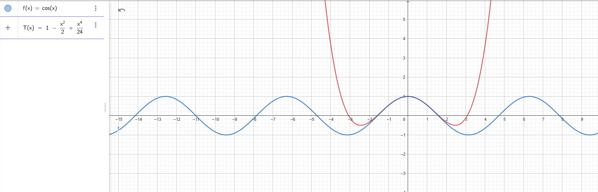
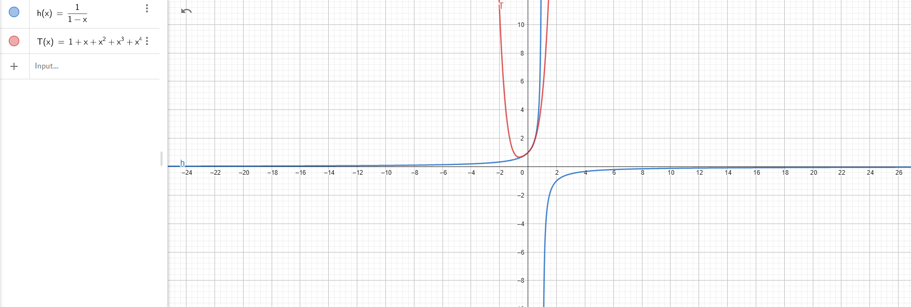
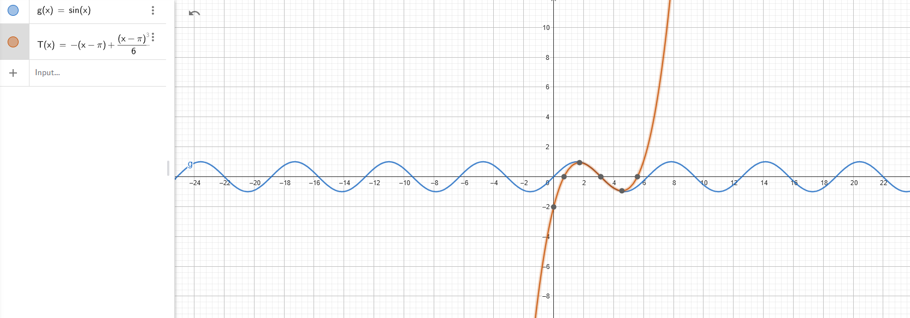

## 1. Basic Operations on Matrices

For following matrices 

$$
\mathbf{A}=
\begin{pmatrix}
1 & 2 \\
3 & 4 
\end{pmatrix}
\qquad
\mathbf{B}=
\begin{pmatrix}
5 & 6 \\
7 & 8
\end{pmatrix}
\quad
\mathbf{C}=
\begin{pmatrix}-1 & 2 \\
3 & 0
\end{pmatrix}
\qquad
\mathbf{D}=
\begin{pmatrix}-1 & 2 & 3 \\
4 & 0 & 6 
\end{pmatrix}
\qquad
\mathbf{E}=
\begin{pmatrix}
1 & 2\\
4 & 5\\
7 & 8
\end{pmatrix}
$$

1. Calculate: $\mathbf{A}+\mathbf{B}$;  $\mathbf{B}-\mathbf{A}$;  $\mathbf{A}+\mathbf{C}$; $\mathbf{D}+\mathbf{E}$. 

2. Calculate $\frac{1}{2}\mathbf{A}$, $2\mathbf{B}$, $-3\mathbf{C}$, and $4\mathbf{D}$.

3. Calculate the products $\mathbf{A}\cdot \mathbf{B}$; $\mathbf{B} \cdot \mathbf{A}$; $\mathbf{A} \cdot \mathbf{D}$; $\mathbf{D} \cdot \mathbf{E}$.

### solutions 1  :

 #### 1. A+B

 $$
\mathbf{A}
\begin{pmatrix}
1 & 2 \\
3 & 4 
\end{pmatrix}
\qquad+ 
\mathbf{B}
\begin{pmatrix}
5 & 6 \\
7 & 8
\end{pmatrix}
\qquad =
\begin{pmatrix}
6 & 8 \\
10 & 12
\end{pmatrix}.
$$

#### 2. B-A

$$
\mathbf{B}
\begin{pmatrix}
5 & 6 \\
7 & 8
\end{pmatrix}
\qquad - 
\mathbf{A}
\begin{pmatrix}
1 & 2 \\
3 & 4
\end{pmatrix}
\qquad =
\begin{pmatrix}
4 & 4 \\
4 & 4
\end{pmatrix}.
$$

#### 3. A+C

$$
\mathbf{A} = 
\begin{pmatrix}
1 & 2 \\
3 & 4
\end{pmatrix}
\quad + \quad
\mathbf{C} = 
\begin{pmatrix}-1 & 2 \\
3 & 0
\end{pmatrix}
\quad =
\begin{pmatrix}
0 & 4 \\
6 & 4
\end{pmatrix}
$$

#### 4. D+E

D+E is not defined due to incompatible dimensions.

### solutions for 2  :

#### 1. A1/2

$$
\mathbf{A} = 
\begin{pmatrix}
1 & 2 \\
3 & 4
\end{pmatrix}
\quad \times \quad \frac{1}{2} = 
\begin{pmatrix}
\frac{1}{2} & 1 \\
\frac{3}{2} & 2
\end{pmatrix}
$$

#### 2. B*2

$$
\mathbf{B} = 
\begin{pmatrix}
5 & 6 \\
7 & 8
\end{pmatrix}
\quad \times \quad 2 = 
\begin{pmatrix}
10 & 12 \\
14 & 16
\end{pmatrix}
$$

#### 3. -3*C

$$
\mathbf{C} = 
\begin{pmatrix}-1 & 2 \\
3 & 0
\end{pmatrix}
\quad \times \quad -3 = 
\begin{pmatrix}
3 & -6 \\-9 & 0
\end{pmatrix}
$$

#### 4. 4*D

$$
\mathbf{D} = 
\begin{pmatrix}-1 & 2 & 3 \\
4 & 0 & 6
\end{pmatrix}
\quad \times \quad 4 = 
\begin{pmatrix}-4 & 8 & 12 \\
16 & 0 & 24
\end{pmatrix}
$$

### solutions for 3:

#### 1. A*B

$$
\mathbf{A} = 
\begin{pmatrix}
1 & 2 \\
3 & 4
\end{pmatrix}
\quad \text{and} \quad
\mathbf{B} = 
\begin{pmatrix}
5 & 6 \\
7 & 8
\end{pmatrix}
$$

$$
\mathbf{A} \cdot \mathbf{B} = 
\begin{pmatrix}
(1 \cdot 5 + 2 \cdot 7) & (1 \cdot 6 + 2 \cdot 8) \\
(3 \cdot 5 + 4 \cdot 7) & (3 \cdot 6 + 4 \cdot 8)
\end{pmatrix}=
\begin{pmatrix}
19 & 22 \\
43 & 50
\end{pmatrix}
$$

---

#### 2.B*A

$$
\mathbf{B} = 
\begin{pmatrix}
5 & 6 \\
7 & 8
\end{pmatrix}
\quad \text{and} \quad
\mathbf{A} = 
\begin{pmatrix}
1 & 2 \\
3 & 4
\end{pmatrix}
$$

$$
\mathbf{B} \cdot \mathbf{A} = 
\begin{pmatrix}
(5 \cdot 1 + 6 \cdot 3) & (5 \cdot 2 + 6 \cdot 4) \\
(7 \cdot 1 + 8 \cdot 3) & (7 \cdot 2 + 8 \cdot 4)
\end{pmatrix}=
\begin{pmatrix}
23 & 34 \\
31 & 46
\end{pmatrix}
$$

---

#### 3. A*D

$$
\mathbf{A} = 
\begin{pmatrix}
1 & 2 \\
3 & 4
\end{pmatrix}
\quad \text{and} \quad
\mathbf{D} = 
\begin{pmatrix}-1 & 2 & 3\\
4 & 0 & 6
\end{pmatrix}
$$

$$
\mathbf{A} \cdot \mathbf{D} = 
\begin{pmatrix}
(1 \cdot -1 + 2 \cdot 4) & (1 \cdot 2 + 2 \cdot 0) & (1 \cdot 3 + 2 \cdot 6) \\
(3 \cdot -1 + 4 \cdot 4) & (3 \cdot 2 + 4 \cdot 0) & (3 \cdot 3 + 4 \cdot 6)
\end{pmatrix}=
\begin{pmatrix}
7 & 2 & 15 \\
13 & 6 & 33
\end{pmatrix}
$$

---

#### 4. D*E

$$
\mathbf{D} = 
\begin{pmatrix}-1 & 2 & 3\\
4 & 0 & 6
\end{pmatrix}
\quad \text{and} \quad
\mathbf{E} = 
\begin{pmatrix}
1 & 2 \\
4 & 5 \\
7 & 8
\end{pmatrix}
$$

$$
\mathbf{D} \cdot \mathbf{E} = 
\begin{pmatrix} -1 & 2 & 3 \\
4 & 0 & 6
\end{pmatrix}
\cdot
\begin{pmatrix}
1 & 2 \\
4 & 5 \\
7 & 8
\end{pmatrix} =
\begin{pmatrix}
(-1 \cdot 1 + 2 \cdot 4 + 3 \cdot 7) & (-1 \cdot 2 + 2 \cdot 5 + 3 \cdot 8) \\
(4 \cdot 1 + 0 \cdot 4 + 6 \cdot 7) & (4 \cdot 2 + 0 \cdot 5 + 6 \cdot 8)
\end{pmatrix} =
\begin{pmatrix}
28 & 32 \\
46 & 56
\end{pmatrix}
$$

---

---

## 14. Equations of lines on a plane

### 3. The line passes through point 
 A(1, 2) and is perpendicular to the line 
 y = 2x + 3 .

---

### 1: Find the slope of the given line

The slope of the line $y = 2x + 3$ is $m_1 = 2$.

### 2: Determine the slope of the perpendicular line

$$
m_1 \cdot m_2 = -1
$$

$$
2 \cdot m_2 = -1
$$

$$
m_2 = -\frac{1}{2}
$$

### 3: Write the equation of the line

$$
y - y_1 = m(x - x_1)
$$

$$
y - 2 = -\frac{1}{2}(x - 1)
$$

### 4: Simplify the equation

Expand and simplify:

$$
y - 2 = -\frac{1}{2}x + \frac{1}{2}
$$

$$
y = -\frac{1}{2}x + \frac{5}{2}
$$

So, the equation of the line is:

$$
y = -\frac{1}{2}x + \frac{5}{2}
$$

---

### 4. To find the intersection point and the angle between the lines  y = 2x + 3  and  y = 3x + 2 .

### 1: Find the intersection point

$$
2x + 3 = 3x + 2
$$

Simplify:

$$
3 = x + 2
$$

$$
x = 1
$$

Substitute  x = 1  into either equation to find y:

$$
y = 2(1) + 3 = 5
$$

Thus, the intersection point is:

$$
(1, 5)
$$

---

### 2: Find the angle between the two lines

The slopes of the lines are: 

$$ m_1 = 2 \quad \text{from} \quad y = 2x + 3 $$ 

$$ m_2 = 3 \quad \text{from} \quad y = 3x + 2 $$

The angle between the lines is given by:

$$ 
\tan\theta = \left| \frac{m_2 - m_1}{1 + m_1 m_2} \right|
$$

Substitute 
$ m_1 = 2 $ and $ m_2 = 3 $:

$$
\tan\theta = \left| \frac{3 - 2}{1 + (2)(3)} \right| = \left| \frac{1}{7} \right|
$$

Now, find the angle by taking the arctangent:

$$ 
\theta = \arctan\left( \frac{1}{7} \right)
$$

---

### **Finally**

- **Intersection Point**:  (1, 5) 
- **Angle Between the Lines**:

$$
\theta = \arctan\left( \frac{1}{7} \right) \approx 8.13^\circ
$$

---

### 5. Find the equation of a line passing through the point A(1, 2) and parallel to the vector $\mathbf{v} = [2, 3]$

---

### 1: Parametric equation of the line

$$
x = x_1 + t v_x
$$

$$
y = y_1 + t v_y
$$

where t is a parameter

$$
x = 1 + 2t
$$

$$
y = 2 + 3t
$$

---

### 2: Eliminate the parameter t to find the Cartesian form

From the parametric equation  x = 1 + 2t , solve for  t :

$$
t = \frac{x - 1}{2}
$$

Substitute this expression for  t  into  y = 2 + 3t :

$$
y = 2 + 3\left(\frac{x - 1}{2}\right)
$$

Simplify:

$$
y = 2 + \frac{3(x - 1)}{2}
$$

$$
y = 2 + \frac{3x}{2} - \frac{3}{2}
$$

$$
y = \frac{3x}{2} + \frac{4}{2} - \frac{3}{2}
$$

$$
y = \frac{3x}{2} + \frac{1}{2}
$$

---

### Finally:

$$
y = \frac{3}{2}x + \frac{1}{2}
$$

---

### 6. We are given the line equation $y = 2x + 3$

### 1. Line Parallel to $y = 2x + 3$:

The slope of the parallel line will also be 2.

$$
y = 2x + b
$$

where b is any y-intercept. For example, if b = 1 , the equation of the parallel line is:

$$
y = 2x + 1
$$

### 2. Line Perpendicular to $y = 2x + 3$:

Two lines are perpendicular if the product of their slopes is $-1$. Let the slope of the perpendicular line be $m'$. The relationship between the slopes of the given line and the perpendicular line is:

$$
m \cdot m' = -1
$$

Given that the slope of the original line is $m = 2$, we solve for $m'$:

$$
2 \cdot m' = -1 \quad \Rightarrow \quad m' = -\frac{1}{2}
$$

Thus, the slope of the perpendicular line is $m' = -\frac{1}{2}$. The equation of a perpendicular line can be written as:

$$
y = -\frac{1}{2}x + b
$$

where $b$ is any y-intercept. For example, if $b = 4$, the equation of the perpendicular line is:

$$
y = -\frac{1}{2}x + 4
$$

---

### Finally:

- A parallel line: $y = 2x + 1$
- A perpendicular line: $y = -\frac{1}{2}x + 4$

---

### 7. To find the distance from a point $A(x_1, y_1)$ to a line given by the equation $Ax + By + C = 0$, we use the following formula:

$$
\text{Distance} = \frac{|Ax_1 + By_1 + C|}{\sqrt{A^2 + B^2}}
$$

### Step 1: Rewrite the equation of the line in the form $ Ax + By + C = 0 $

The given line equation is $y = 2x + 3$. We can rewrite it in standard form by subtracting $y$ from both sides:

$$
y - 2x - 3 = 0
$$

This gives $A = -2$, $B = 1$, and $C = -3$.

### Step 2: Apply the formula

The coordinates of point $A$ are $(x_1, y_1) = (1, 2)$. Substituting $x_1 = 1$, $y_1 = 2$, $A = -2$, $B = 1$, and $C = -3$ into the formula:

$$
\text{Distance} = \frac{|(-2)(1) + (1)(2) - 3|}{\sqrt{(-2)^2 + 1^2}} = \frac{| -2 + 2 - 3 |}{\sqrt{4 + 1}} = \frac{|-3|}{\sqrt{5}} = \frac{3}{\sqrt{5}}
$$

### Step 3: Simplify the expression

To rationalize the denominator:

$$
\text{Distance} = \frac{3}{\sqrt{5}} \cdot \frac{\sqrt{5}}{\sqrt{5}} = \frac{3\sqrt{5}}{5}
$$

### Finally:

The distance from point $A(1, 2)$ to the line $y = 2x + 3 $is:

$$
\frac{3\sqrt{5}}{5}
$$

---

### 8. We are given that the line intersects the coordinate axes at points $A(2, 0)$ and $B(0, 3)$. Find the equation of the line, we can use the **two-point form** of the equation of a line, which is:

$$
y - y_1 = m(x - x_1)
$$

### Step 1: Find the slope of the line

The slope $m$ of the line through points $A(2, 0)$ and $B(0, 3)$ is given by the formula:

$$
m = \frac{3 - 0}{0 - 2} = \frac{3}{-2} = -\frac{3}{2}
$$

### Step 2: Write the equation of the line

Substitute the slope $m = -\frac{3}{2}$ and point $A(2, 0)$ into the two-point form:

$$
y - 0 = -\frac{3}{2}(x - 2)
$$

Simplify the equation:

$$
y = -\frac{3}{2}(x - 2)
$$

### Step 3: Expand the equation

$$
y = -\frac{3}{2}x + 3
$$

### Finally:

The equation of the line is:

$$
y = -\frac{3}{2}x + 3
$$

---

### 9. We are given the line equation $y = x + 3$, need to calculate the angle between the line and the $Ox$-axis.

### Step 1: Find the slope of the line

The equation of the line is in slope-intercept form $y = mx + b$, where $m$ is the slope. From the equation $y = x + 3$, we see that the slope $m = 1$.

### Step 2: Use the formula for $\theta$, the angle between the line and the $Ox$-axis

$$
\tan(\theta) = m
$$

Substituting  m = 1  into the formula:

$$
\tan(\theta) = 1
$$

### Step 3: To find $\theta$, take the inverse tangent (arctan) of both sides:

$$
\theta = \tan^{-1}(1)
$$

From trigonometry, we know that:

$$
\theta = 45^\circ
$$

### Final Answer:

The angle between the line $y = x + 3$ and the $Ox$-axis is:

$$
\theta = 45^\circ
$$

### 10. We are given the line equation $x + y + 1 = 0$, and we need to find a vector perpendicular to this line.

---

## 15. Equations of second-order curves (conic sections)

### 1. The equation of a circle with center at point $A(h, k)$ and radius r is given by the standard form:

$$
(x - h)^2 + (y - k)^2 = r^2
$$

### Given:

- Center $A(1, 2)$, so $h = 1$ and $k = 2$.
- Radius $r = 3$, so $r^2 = 9$.

### Substitute the values into the equation

Substitute $h = 1$, $k = 2$, and $r = 3$ into the general equation:

$$
(x - 1)^2 + (y - 2)^2 = 9
$$

---

### 2. To find the equation of a parabola intersecting the $Ox$ axis at points $x = 2$ and $x = 4$, and passing through the point $(3, 1)$, we can proceed as follows:

### Step 1: General Form of the Parabola

Since the parabola intersects the $Ox$ axis at $x = 2$ and $x = 4$, we can express the equation of the parabola as:

$$
y = a(x - 2)(x - 4)
$$

where a is a constant to be determined.

### Step 2: Use the Point $(3, 1)$

We know the parabola passes through the point $(3, 1)$. Substituting $x = 3$ and $y = 1$ into the equation:

$$
1 = a(3 - 2)(3 - 4)
$$

This simplifies to:

$$
1 = a(1)(-1)
$$

$$
1 = -a
$$

Thus, we find:

$$
a = -1
$$

### Step 3: Write the Final Equation

Substitute $a = -1$ into the equation of the parabola:

$$
y = -1(x - 2)(x - 4)
$$

Simplifying:

$$
y = -(x - 2)(x - 4)
$$

Expanding:

$$
y = -x^2 + 6x - 8
$$

Thus, the equation of the parabola is:

$$
y = -x^2 + 6x - 8
$$

---

##  19. Limits of Sequences

## Problem 1: 

$$
 \lim_{n \to \infty} \frac{n^2 + 3n}{2n^2 - 2n} 
 $$

### Step 1: Factor out the highest power of n
$$
\frac{n^2 + 3n}{2n^2 - 2n} = \frac{n^2(1 + \frac{3}{n})}{n^2(2 - \frac{2}{n})}.
$$

### Step 2: Simplify the fraction

$$
\frac{n^2(1 + \frac{3}{n})}{n^2(2 - \frac{2}{n})} = \frac{1 + \frac{3}{n}}{2 - \frac{2}{n}}.
$$

### Step 3: 

$$
\text{As } n \to \infty, \frac{3}{n} \to 0 \text{ and } \frac{2}{n} \to 0:
$$

$$
\lim_{n \to \infty} \frac{1 + \frac{3}{n}}{2 - \frac{2}{n}} = \frac{1 + 0}{2 - 0} = \frac{1}{2}.
$$

**Final Answer:**

$$
\frac{1}{2}.
$$

---

## Problem 2: 

$$
\lim_{n \to \infty} \frac{(2n+3)^3}{n^3-1} 
$$

### Step 1: Expand the numerator

The numerator $(2n + 3)^3$ expands as:

$$
(a + b)^3 = a^3 + 3a^2b + 3ab^2 + b^3
$$

$$
(2n + 3)^3 = 8n^3 + 36n^2 + 54n + 27.
$$

Thus, the fraction becomes:

$$
\frac{(2n+3)^3}{n^3-1} = \frac{8n^3 + 36n^2 + 54n + 27}{n^3 - 1}.
$$

### Step 2: Factor out the highest power of $n$

Divide through by $n^3$:

$$
\frac{8n^3 + 36n^2 + 54n + 27}{n^3 - 1} = \frac{n^3 \left( 8 + \frac{36}{n} + \frac{54}{n^2} + \frac{27}{n^3} \right)}{n^3 \left( 1 - \frac{1}{n^3} \right)}.
$$

### Step 3: Simplify the fraction

$$
\frac{8 + \frac{36}{n} + \frac{54}{n^2} + \frac{27}{n^3}}{1 - \frac{1}{n^3}}.
$$

### Step 4: 

$$
\text{As} \ n \to \infty \, \\frac{36}{n} \to 0 \, \\frac{54}{n^2} \to 0 \, \ \frac{27}{n^3} \to 0 \, and \ \frac{1}{n^3} \to 0 \:
$$

$$
\lim_{n \to \infty} \frac{8 + \frac{36}{n} + \frac{54}{n^2} + \frac{27}{n^3}}{1 - \frac{1}{n^3}} = \frac{8 + 0 + 0 + 0}{1 - 0} = 8.
$$

**Final Answer:**

$$
\lim_{n \to \infty} \frac{(2n+3)^3}{n^3-1} = 8.
$$

---

## 2 . Proof Using the Squeeze Theorem

We are tasked with proving that:

$$
\lim_{n \to \infty} \frac{\sin(n)}{n} = 0
$$

### Step 1:

$$
\text {Analyze the bounds of} \ \sin(n) \
$$

The sine function is bounded for all real numbers $n$, so:

$$
-1 \leq \sin(n) \leq 1
$$

### Step 2: Divide the inequality by $n$ (for$ n > 0$)

Since $n$ is positive as $n \to \infty$, we can divide the inequality by $n$:

$$
\frac{-1}{n} \leq \frac{\sin(n)}{n} \leq \frac{1}{n}
$$

### Step 3: 

$$
\text {Take the limit of the bounds as} \ n \to \infty 
$$

Now, we compute the limits of the bounds:

 The limit of $\frac{-1}{n}$ as $n \to \infty$ is $0$:

$$
\lim_{n \to \infty} \frac{-1}{n} = 0
$$

The limit of $\frac{1}{n}$ as $n \to \infty$ is also $0$:

$$
\lim_{n \to \infty} \frac{1}{n} = 0
$$

### Step 4: Apply the Squeeze Theorem

Since we have:

$$
\frac{-1}{n} \leq \frac{\sin(n)}{n} \leq \frac{1}{n}
$$

and both the lower and upper bounds approach 0 as $n \to \infty$, by the **Squeeze Theorem**, we conclude that:

$$
\lim_{n \to \infty} \frac{\sin(n)}{n} = 0
$$

### Final Answer:

$$
\lim_{n \to \infty} \frac{\sin(n)}{n} = 0
$$

---

## 3. Limit of the Sequence

### Step 1: Sequence Setup

We are given the sequence:

$$
a_n = \left( 1 + \frac{1}{n} \right)^n
$$

### Step 2: Recognize the Limit

This is a standard limit that is used to define the number $ e $ (Euler's number). The limit is known to be:

$$
\lim_{n \to \infty} \left( 1 + \frac{1}{n} \right)^n = e
$$

### Step 3: Conclusion

$$
\text {Therefore, the limit of the sequence} \ a_n \ as \ n \to \infty \ is:
$$ 

$$
\lim_{n \to \infty} \left( 1 + \frac{1}{n} \right)^n = e
$$

---

## 20 . Limit of the Real Function

## 1.

We are tasked with computing the limit:

$$
\lim_{x \to \infty} \frac{x^3 + 2x^2}{x^4 - 3x^3}
$$

### Step 1: Analyze the Degrees of the Polynomial

- The numerator is $x^3 + 2x^2$, and the highest power of $x$ in the numerator is $x^3$.
- The denominator is $x^4 - 3x^3$, and the highest power of $x$ in the denominator is $x^4$.

### Step 2: Simplify by Dividing by the Highest Power of $x$

Since the highest degree in the denominator is $x^4$, we divide both the numerator and denominator by $x^4$ to simplify:

$$
\frac{x^3 + 2x^2}{x^4 - 3x^3} = \frac{\frac{x^3}{x^4} + \frac{2x^2}{x^4}}{\frac{x^4}{x^4} - \frac{3x^3}{x^4}} = \frac{\frac{1}{x} + \frac{2}{x^2}}{1 - \frac{3}{x}}
$$

### Step 3:

$$
\text {As} \ x \to \infty \:
$$

$$
\ \frac{1}{x} \to 0 \
\ \frac{2}{x^2} \to 0 \
\ \frac{3}{x} \to 0 \
$$

Thus, the expression simplifies to:

$$
\frac{0 + 0}{1 - 0} = 0
$$

### Final Answer:

$$
\lim_{x \to \infty} \frac{x^3 + 2x^2}{x^4 - 3x^3} = 0
$$

---

## 2. We are tasked with finding the limit:

$$
\lim_{x \to 0} \frac{\sin(3x)}{2x+1}.
$$

### Step 1: Evaluate the limit of the numerator as$ x \to 0$

$$
\text {The numerator is} \ \sin(3x) \ . \text{We know that}:
$$

$$
\lim_{x \to 0} \sin(3x) = \sin(0) = 0.
$$

### Step 2: Evaluate the limit of the denominator as $x \to 0$

The denominator is 2x + 1 . Substituting x = 0 :

$$
2(0) + 1 = 1.
$$

### Step 3: Combine the results

Now we can compute the overall limit:

$$
\lim_{x \to 0} \frac{\sin(3x)}{2x+1} = \frac{\lim_{x \to 0} \sin(3x)}{\lim_{x \to 0} (2x+1)} = \frac{0}{1} = 0.
$$

Thus, the value of the limit is:

$$
\boxed{0}.
$$

 ## 3.We are tasked with finding the asymptotes of the functions:

### 1. 

$$
\ f(x) = \frac{x^2 - 1}{x^2 + 1} \
$$

#### Step 1: Horizontal Asymptotes

$$
\text{As} \ x \to \infty \ 
$$

$$
\lim_{x \to \infty} f(x) = \lim_{x \to \infty} \frac{x^2 - 1}{x^2 + 1} = \frac{1}{1} = 1.
$$

Thus, there is a horizontal asymptote at y = 1.

#### Step 2: Vertical Asymptotes

Vertical asymptotes occur when the denominator equals zero and the numerator is non-zero at that point. The denominator is $x^2 + 1$, which is never zero for any real value of $x$ (since $x^2 + 1 > 0$ for all $x$). Therefore, there are no vertical asymptotes.

### Asymptotes for $f(x)$:

- Horizontal asymptote at $y = 1$.
- No vertical asymptotes.

### 2. 

$$
\ g(x) = \frac{\sin(x)}{x^2 + 1} \
$$

#### Step 1: Horizontal Asymptotes

To find horizontal asymptotes, we examine the behavior of $g(x)$ as $x \to \infty$ and $x \to -\infty$.

- As $x \to \infty$ or $x \to -\infty$, the denominator $x^2 + 1$ grows much faster than the numerator $\sin(x)$, which is bounded between -1 and 1. Hence, we have:

$$
\lim_{x \to \infty} g(x) = \lim_{x \to \infty} \frac{\sin(x)}{x^2 + 1} = 0.
$$

Thus, there is a horizontal asymptote at $y = 0$.

#### Step 2: Vertical Asymptotes

Vertical asymptotes occur when the denominator equals zero and the numerator is non-zero at that point. The denominator is $x^2 + 1$, which is never zero for any real value of $x$. Therefore, there are no vertical asymptotes.

### Asymptotes for $g(x)$:

- Horizontal asymptote at $y = 0$.
- No vertical asymptotes.

 
=======

### Step 1: Factor out the highest power of $n$

$$
\frac{n^2 + 3n}{2n^2 - 2n} = \frac{n^2(1 + \frac{3}{n})}{n^2(2 - \frac{2}{n})}.
$$

### Step 2: Simplify the fraction

$$
\frac{n^2(1 + \frac{3}{n})}{n^2(2 - \frac{2}{n})} = \frac{1 + \frac{3}{n}}{2 - \frac{2}{n}}.
$$

### Step 3: 

$$
\text{As } n \to \infty, \frac{3}{n} \to 0 \text{ and } \frac{2}{n} \to 0:
$$

$$
\lim_{n \to \infty} \frac{1 + \frac{3}{n}}{2 - \frac{2}{n}} = \frac{1 + 0}{2 - 0} = \frac{1}{2}.
$$

**Final Answer:**

$$
\lim_{n \to \infty} \frac{n^2 + 3n}{2n^2 - 2n} = \frac{1}{2}.
$$

---

## Problem 2: 

$$
\lim_{n \to \infty} \frac{(2n+3)^3}{n^3-1} 
$$

### Step 1: Expand the numerator

The numerator $(2n + 3)^3$ expands as: 

$$
(a + b)^3 = a^3 + 3a^2b + 3ab^2 + b^3
$$

$$
(2n + 3)^3 = 8n^3 + 36n^2 + 54n + 27.
$$

Thus, the fraction becomes:

$$
\frac{(2n+3)^3}{n^3-1} = \frac{8n^3 + 36n^2 + 54n + 27}{n^3 - 1}.
$$

### Step 2: Factor out the highest power of $n$

Divide through by $n^3$:

$$
\frac{8n^3 + 36n^2 + 54n + 27}{n^3 - 1} = \frac{n^3 \left( 8 + \frac{36}{n} + \frac{54}{n^2} + \frac{27}{n^3} \right)}{n^3 \left( 1 - \frac{1}{n^3} \right)}.
$$

### Step 3: Simplify the fraction

$$
\frac{8 + \frac{36}{n} + \frac{54}{n^2} + \frac{27}{n^3}}{1 - \frac{1}{n^3}}.
$$

### Step 4: 

$$
\text{As} \ n \to \infty \, \\frac{36}{n} \to 0 \, \\frac{54}{n^2} \to 0 \, \ \frac{27}{n^3} \to 0 \, and \ \frac{1}{n^3} \to 0 \:
$$

$$
\lim_{n \to \infty} \frac{8 + \frac{36}{n} + \frac{54}{n^2} + \frac{27}{n^3}}{1 - \frac{1}{n^3}} = \frac{8 + 0 + 0 + 0}{1 - 0} = 8.
$$

**Final Answer:**

$$
\lim_{n \to \infty} \frac{(2n+3)^3}{n^3-1} = 8.
$$

---

## 2 . Proof Using the Squeeze Theorem

We are tasked with proving that:

$$
\lim_{n \to \infty} \frac{\sin(n)}{n} = 0
$$

### Step 1:

$$
\text {Analyze the bounds of} \ \sin(n) \
$$

The sine function is bounded for all real numbers $n$, so:

$$
-1 \leq \sin(n) \leq 1
$$

### Step 2: Divide the inequality by $n$ (for $n > 0$)

Since $ n $ is positive as $n \to \infty$, we can divide the inequality by $n$:

$$
\frac{-1}{n} \leq \frac{\sin(n)}{n} \leq \frac{1}{n}
$$

### Step 3: 

$$
\text {Take the limit of the bounds as} \ n \to \infty 
$$

Now, we compute the limits of the bounds:

- The limit of $\frac{-1}{n}$ as $n \to \infty$ is $0$:

$$
\lim_{n \to \infty} \frac{-1}{n} = 0
$$

- The limit of $\frac{1}{n}$ as $n \to \infty$ is also $0$:

$$
\lim_{n \to \infty} \frac{1}{n} = 0
$$

### Step 4: Apply the Squeeze Theorem

Since we have:

$$
\frac{-1}{n} \leq \frac{\sin(n)}{n} \leq \frac{1}{n}
$$

and both the lower and upper bounds approach 0 as $n \to \infty$, by the **Squeeze Theorem**, we conclude that:

$$
\lim_{n \to \infty} \frac{\sin(n)}{n} = 0
$$

### Final Answer:

$$
\lim_{n \to \infty} \frac{\sin(n)}{n} = 0
$$

---

# 3. Limit of the Sequence

### Step 1: Sequence Setup

We are given the sequence:

$$
a_n = \left( 1 + \frac{1}{n} \right)^n
$$

### Step 2: Recognize the Limit

This is a standard limit that is used to define the number $e$ (Euler's number). The limit is known to be:

$$
\lim_{n \to \infty} \left( 1 + \frac{1}{n} \right)^n = e
$$

### Step 3: Conclusion

$$
\text {Therefore, the limit of the sequence} \ a_n \ as \ n \to \infty \ is:
$$ 

$$
\lim_{n \to \infty} \left( 1 + \frac{1}{n} \right)^n = e
$$

---

## 20 . Limit of the Real Function

## 1.

We are tasked with computing the limit:

$$
\lim_{x \to \infty} \frac{x^3 + 2x^2}{x^4 - 3x^3}
$$

### Step 1: Analyze the Degrees of the Polynomial

- The numerator is $x^3 + 2x^2$, and the highest power of $x$ in the numerator is $x^3$.
- The denominator is $x^4 - 3x^3$, and the highest power of $x$ in the denominator is $x^4$.

### Step 2: Simplify by Dividing by the Highest Power of $x$

Since the highest degree in the denominator is $x^4$, we divide both the numerator and denominator by $x^4$ to simplify:

$$
\frac{x^3 + 2x^2}{x^4 - 3x^3} = \frac{\frac{x^3}{x^4} + \frac{2x^2}{x^4}}{\frac{x^4}{x^4} - \frac{3x^3}{x^4}} = \frac{\frac{1}{x} + \frac{2}{x^2}}{1 - \frac{3}{x}}
$$

### Step 3:

$$
\text {As} \ x \to \infty \:
$$

$$
\ \frac{1}{x} \to 0 \
\ \frac{2}{x^2} \to 0 \
\ \frac{3}{x} \to 0 \
$$

Thus, the expression simplifies to:

$$
\frac{0 + 0}{1 - 0} = 0
$$

### Final Answer:

$$
\lim_{x \to \infty} \frac{x^3 + 2x^2}{x^4 - 3x^3} = 0
$$

---

## 2. We are tasked with finding the limit:

$$
\lim_{x \to 0} \frac{\sin(3x)}{2x+1}.
$$

### Step 1: Evaluate the limit of the numerator as $x \to 0$

$$
\text {The numerator is} \ \sin(3x) \ . \text{We know that}:
$$

$$
\lim_{x \to 0} \sin(3x) = \sin(0) = 0.
$$

###Step 2: Evaluate the limit of the denominator as x → 0. The denominator is 2x + 1. Substituting x = 0:

$$
2(0) + 1 = 1.
$$

### Step 3: Combine the results

Now we can compute the overall limit:

$$
\lim_{x \to 0} \frac{\sin(3x)}{2x+1} = \frac{\lim_{x \to 0} \sin(3x)}{\lim_{x \to 0} (2x+1)} = \frac{0}{1} = 0.
$$

Thus, the value of the limit is:

$$
\boxed{0}.
$$

 ## 3.We are tasked with finding the asymptotes of the functions:

### 1. 

$$
\ f(x) = \frac{x^2 - 1}{x^2 + 1} \
$$

#### Step 1: Horizontal Asymptotes

$$
\text{As} \ x \to \infty \ 
$$

$$
\lim_{x \to \infty} f(x) = \lim_{x \to \infty} \frac{x^2 - 1}{x^2 + 1} = \frac{1}{1} = 1.
$$

Thus, there is a horizontal asymptote at y = 1 .

#### Step 2: Vertical Asymptotes

Vertical asymptotes occur when the denominator equals zero and the numerator is non-zero at that point. The denominator is $x^2 + 1$, which is never zero for any real value of $x$ (since $x^2 + 1 > 0$ for all $x$). Therefore, there are no vertical asymptotes.

### Asymptotes for $f(x)$:

- Horizontal asymptote at $y = 1$.
- No vertical asymptotes.

### 2. 

$$
\ g(x) = \frac{\sin(x)}{x^2 + 1} \
$$

#### Step 1: Horizontal Asymptotes

To find horizontal asymptotes, we examine the behavior of $g(x)$ as $x \to \infty$ and $x \to -\infty$.

As $x \to \infty$ or $x \to -\infty$, the denominator $x^2 + 1$ grows much faster than the numerator $\sin(x)$, which is bounded between $-1$ and $1$. Hence, we have:

$$
\lim_{x \to \infty} g(x) = \lim_{x \to \infty} \frac{\sin(x)}{x^2 + 1} = 0,
$$

and similarly,

$$
\lim_{x \to -\infty} g(x) = \lim_{x \to -\infty} \frac{\sin(x)}{x^2 + 1} = 0.
$$

Therefore, the horizontal asymptote is:

$$
y = 0.
$$

$$
\lim_{x \to \infty} g(x) = \lim_{x \to \infty} \frac{\sin(x)}{x^2 + 1} = 0.
$$

Thus, there is a horizontal asymptote at $y = 0$.

#### Step 2: Vertical Asymptotes

Vertical asymptotes occur when the denominator equals zero and the numerator is non-zero at that point. The denominator is $x^2 + 1$, which is never zero for any real value of $x$. Therefore, there are no vertical asymptotes.

### Asymptotes for $g(x)$:

- Horizontal asymptote at $y = 0$.
- No vertical asymptotes.

# 22. Extremum  

## 6 . The profit function is given as $P(u) = -2u^2 + 50u - 300$, where $u$ is the number of units sold. Find the number of units $u$ that maximize profit.

### Step 1: Identify the general form of a quadratic equation
The profit function $P(u) = -2u^2 + 50u - 300$ is a quadratic equation of the form:
$$
P(u) = ax^2 + bx + c
$$
Here:
- $a = -2$
- $b = 50$
- $c = -300$

---

### Step 2: Recall the formula for the vertex
For a quadratic equation, the maximum (or minimum) value occurs at the vertex. The formula to find the $x$-coordinate (or $u$ in this case) of the vertex is:

$$
u = -\frac{b}{2a}
$$

---

### Step 3: Substitute the values of $a$ and $b$

$$
u = -\frac{b}{2a} = -\frac{50}{2(-2)} = \frac{50}{4} = 12.5
$$

---

### Step 4: Interpret the result
The number of units $u$ that maximizes the profit is:

$$
u = 12.5
$$

If you require the result in whole numbers (depending on the problem's context), the maximum could occur at either $u = 12$ or $u = 13$. You can test both values in the profit function to determine which gives the higher profit.

---

## Final Answer:
The number of units that maximize profit is:

$$
u = 12.5
$$

## 7.Find the extremum of $f(x) = \frac{x^2 + 2x + 1}{x - 1}$.

### Step 1: Simplify the function
The numerator can be factored as:

$$
x^2 + 2x + 1 = (x + 1)^2
$$
Thus:
$$
f(x) = \frac{(x + 1)^2}{x - 1}
$$

---

### Step 2: Find the derivative $f'(x)$
Use the quotient rule:

$$
f'(x) = \frac{(x - 1) \cdot 2(x + 1) - (x + 1)^2 \cdot 1}{(x - 1)^2}
$$

Simplify the numerator:

$$
f'(x) = \frac{2(x + 1)(x - 1) - (x + 1)^2}{(x - 1)^2}
$$

Factor out $(x + 1)$:

$$
f'(x) = \frac{(x + 1)\left[2(x - 1) - (x + 1)\right]}{(x - 1)^2}
$$
Simplify further:
$$
f'(x) = \frac{(x + 1)\left[2x - 2 - x - 1\right]}{(x - 1)^2} = \frac{(x + 1)(x - 3)}{(x - 1)^2}
$$

---

### Step 3: Solve $f'(x) = 0$
Set the numerator equal to zero:

$$
(x + 1)(x - 3) = 0
$$
This gives:
$$
x = -1 \, \text{or} \, x = 3
$$

---

### Step 4: Determine the nature of the extremum
To determine whether these points are maxima, minima, or neither, analyze the sign of $f'(x)$ around $x = -1$ and $x = 3$ using a sign chart.

## Final Answer:
- $x = -1$: Behavior must be checked for the function, as this point may not be valid depending on the domain.
- $x = 3$: This may represent an extremum.

Further analysis is required to determine the exact nature of the extrema.

---

## 8. Find the extremum of $f(x) = x^2 + 3x - 5$.

## Solution:

### Step 1: Identify the general form of the quadratic function
The function $f(x) = x^2 + 3x - 5$ is a quadratic function of the form:

$$
f(x) = ax^2 + bx + c
$$

Here:
- $a = 1$
- $b = 3$
- $c = -5$

---

### Step 2: Find the $x$-coordinate of the vertex
The $x$-coordinate of the vertex is given by:

$$
x = -\frac{b}{2a}
$$

Substitute $a = 1$ and $b = 3$:

$$
x = -\frac{3}{2(1)} = -\frac{3}{2}
$$

---

### Step 3: Find the value of $f(x)$ at $x = -\frac{3}{2}$
Substitute $x = -\frac{3}{2}$ into $f(x)$:

$$
f\left(-\frac{3}{2}\right) = \left(-\frac{3}{2}\right)^2 + 3\left(-\frac{3}{2}\right) - 5
$$

Simplify:

$$
f\left(-\frac{3}{2}\right) = \frac{9}{4} - \frac{9}{2} - 5 = \frac{9}{4} - \frac{18}{4} - \frac{20}{4} = -\frac{29}{4}
$$

---

## Final Answer:
The extremum occurs at:

$$
x = -\frac{3}{2}, \, f(x) = -\frac{29}{4}.
$$

This is a **minimum** since $a > 0$.

## 9.Find the extremum of $f(x) = \frac{x^2 + 2x + 1}{x - 1}$.

## Solution:

### Step 1: Simplify the function
The numerator can be factored as:

$$
x^2 + 2x + 1 = (x + 1)^2
$$

Thus:

$$
f(x) = \frac{(x + 1)^2}{x - 1}
$$

---

### Step 2: Find the derivative $f'(x)$
Use the quotient rule:

$$
f'(x) = \frac{(x - 1) \cdot 2(x + 1) - (x + 1)^2 \cdot 1}{(x - 1)^2}
$$

Simplify the numerator:

$$
f'(x) = \frac{2(x + 1)(x - 1) - (x + 1)^2}{(x - 1)^2}
$$

Factor out $(x + 1)$:

$$
f'(x) = \frac{(x + 1)\left[2(x - 1) - (x + 1)\right]}{(x - 1)^2}
$$

Simplify further:

$$
f'(x) = \frac{(x + 1)\left[2x - 2 - x - 1\right]}{(x - 1)^2} = \frac{(x + 1)(x - 3)}{(x - 1)^2}
$$

---

### Step 3: Solve $f'(x) = 0$
Set the numerator equal to zero:

$$
(x + 1)(x - 3) = 0
$$

This gives:

$$
x = -1 \, \text{or} \, x = 3
$$

---

### Step 4: Determine the nature of the extremum
To determine whether these points are maxima, minima, or neither, analyze the sign of $f'(x)$ around $x = -1$ and $x = 3$ using a sign chart.

---

## Final Answer:
- $x = -1$: Behavior must be checked for the function, as this point may not be valid depending on the domain.
- $x = 3$: This may represent an extremum.

Further analysis is required to determine the exact nature of the extrema.

## 23.Taylor Series
### Find the Taylor series for the following functions and visualize the obtained functions in Geogebra:
1. $f(x) = \cos(x)$ around $x = 0$ up to the 4th degree.
2. $h(x) = \frac{1}{1-x}$ around $x = 0$ up to the 4th degree.
3. $g(x) = \sin(x)$ around $x = \pi$ up to the 4th degree.

---

### 1. Taylor Series for $f(x) = \cos(x)$ around $x = 0$ up to the 4th degree
The Taylor series for $f(x)$ around $x = 0$ is given by:

$$
f(x) = \sum_{n=0}^\infty \frac{f^{(n)}(0)}{n!} x^n
$$

For $f(x) = \cos(x)$:
- $f(x) = \cos(x)$
- $f'(x) = -\sin(x)$
- $f''(x) = -\cos(x)$
- $f'''(x) = \sin(x)$
- $f^{(4)}(x) = \cos(x)$ (repeats every 4 terms)

At $x = 0$:
- $f(0) = 1$, $f'(0) = 0$, $f''(0) = -1$, $f'''(0) = 0$, $f^{(4)}(0) = 1$

Thus, the Taylor series up to the 4th degree is:

$$
f(x) \approx 1 - \frac{x^2}{2!} + \frac{x^4}{4!} = 1 - \frac{x^2}{2} + \frac{x^4}{24}
$$

---

### 2. Taylor Series for $h(x) = \frac{1}{1-x}$ around $x = 0$ up to the 4th degree
The Taylor series for $h(x)$ around $x = 0$ is given by:

$$
h(x) = \sum_{n=0}^\infty x^n
$$

The first few terms of the series up to the 4th degree are:

$$
h(x) \approx 1 + x + x^2 + x^3 + x^4
$$

---

### 3. Taylor Series for $g(x) = \sin(x)$ around $x = \pi$ up to the 4th degree
First, shift $g(x)$ by $\pi$: Define $g(x) = \sin(x)$ as $g(x) = \sin(x - \pi)$.

The Taylor series for $g(x)$ around $x = \pi$ is given by:

$$
g(x) = \sum_{n=0}^\infty \frac{g^{(n)}(\pi)}{n!} (x-\pi)^n
$$

For $g(x) = \sin(x)$:
- $g(x) = \sin(x)$
- $g'(x) = \cos(x)$
- $g''(x) = -\sin(x)$
- $g'''(x) = -\cos(x)$
- $g^{(4)}(x) = \sin(x)$ (repeats every 4 terms)

At $x = \pi$:
- $g(\pi) = \sin(\pi) = 0$
- $g'(\pi) = \cos(\pi) = -1$
- $g''(\pi) = -\sin(\pi) = 0$
- $g'''(\pi) = -\cos(\pi) = 1$
- $g^{(4)}(\pi) = \sin(\pi) = 0$

Thus, the Taylor series up to the 4th degree is:

$$
g(x) \approx - (x - \pi) + \frac{(x - \pi)^3}{3!}
$$

Simplify:

$$
g(x) \approx -(x - \pi) + \frac{(x - \pi)^3}{6}
$$

---