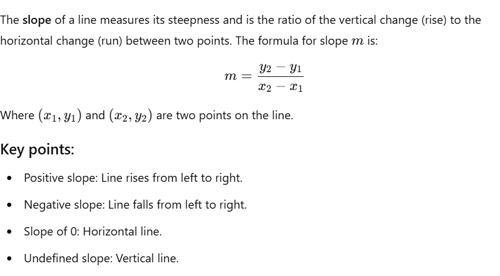
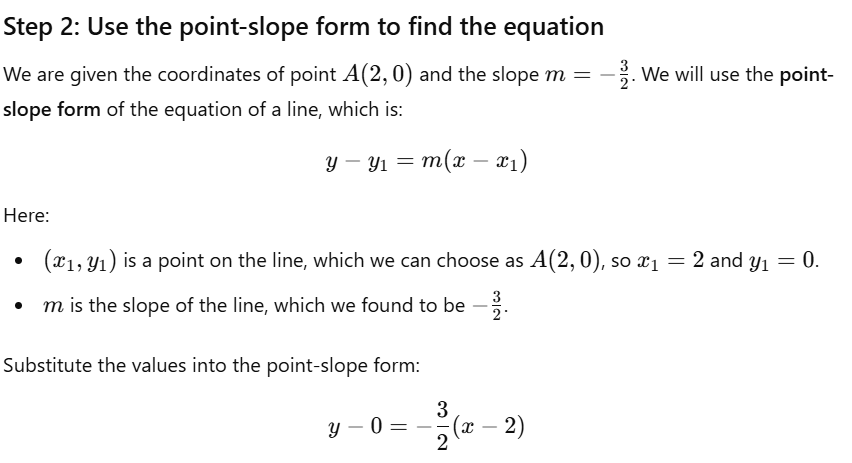
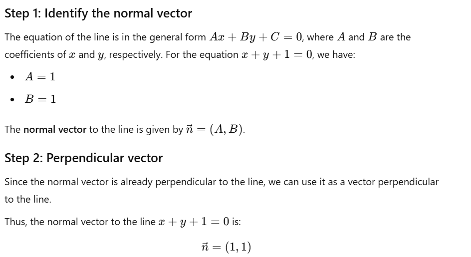

## 1. Basic Operations on Matrices

For following matrices 

$$
\mathbf{A}=
\begin{pmatrix}
1 & 2 \\
3 & 4 
\end{pmatrix}
\qquad
\mathbf{B}=
\begin{pmatrix}
5 & 6 \\
7 & 8
\end{pmatrix}
\quad
\mathbf{C}=
\begin{pmatrix}-1 & 2 \\
3 & 0
\end{pmatrix}
\qquad
\mathbf{D}=
\begin{pmatrix}-1 & 2 & 3 \\
4 & 0 & 6 
\end{pmatrix}
\qquad
\mathbf{E}=
\begin{pmatrix}
1 & 2\\
4 & 5\\
7 & 8
\end{pmatrix}
$$

1. Calculate: $\mathbf{A}+\mathbf{B}$;  $\mathbf{B}-\mathbf{A}$;  $\mathbf{A}+\mathbf{C}$; $\mathbf{D}+\mathbf{E}$. 

2. Calculate $\frac{1}{2}\mathbf{A}$, $2\mathbf{B}$, $-3\mathbf{C}$, and $4\mathbf{D}$.

3. Calculate the products $\mathbf{A}\cdot \mathbf{B}$; $\mathbf{B} \cdot \mathbf{A}$; $\mathbf{A} \cdot \mathbf{D}$; $\mathbf{D} \cdot \mathbf{E}$.

### solutions 1  :
 #### 1. A+B
 $$
\mathbf{A}
\begin{pmatrix}
1 & 2 \\
3 & 4 
\end{pmatrix}
\qquad+ 
\mathbf{B}
\begin{pmatrix}
5 & 6 \\
7 & 8
\end{pmatrix}
\qquad =
\begin{pmatrix}
6 & 8 \\
10 & 12
\end{pmatrix}.
$$

#### 2. B-A
$$
\mathbf{B}
\begin{pmatrix}
5 & 6 \\
7 & 8
\end{pmatrix}
\qquad - 
\mathbf{A}
\begin{pmatrix}
1 & 2 \\
3 & 4
\end{pmatrix}
\qquad =
\begin{pmatrix}
4 & 4 \\
4 & 4
\end{pmatrix}.
$$

#### 3. A+C
$$
\mathbf{A} = 
\begin{pmatrix}
1 & 2 \\
3 & 4
\end{pmatrix}
\quad + \quad
\mathbf{C} = 
\begin{pmatrix}-1 & 2 \\
3 & 0
\end{pmatrix}
\quad =
\begin{pmatrix}
0 & 4 \\
6 & 4
\end{pmatrix}
$$

#### 4. D+E

D+E is not defined due to incompatible dimensions.

### solutions for 2  :
#### 1. A1/2
$$
\mathbf{A} = 
\begin{pmatrix}
1 & 2 \\
3 & 4
\end{pmatrix}
\quad \times \quad \frac{1}{2} = 
\begin{pmatrix}
\frac{1}{2} & 1 \\
\frac{3}{2} & 2
\end{pmatrix}
$$
#### 2. B*2
$$
\mathbf{B} = 
\begin{pmatrix}
5 & 6 \\
7 & 8
\end{pmatrix}
\quad \times \quad 2 = 
\begin{pmatrix}
10 & 12 \\
14 & 16
\end{pmatrix}
$$

#### 3. -3*C

$$
\mathbf{C} = 
\begin{pmatrix}-1 & 2 \\
3 & 0
\end{pmatrix}
\quad \times \quad -3 = 
\begin{pmatrix}
3 & -6 \\-9 & 0
\end{pmatrix}
$$
#### 4. 4*D
$$
\mathbf{D} = 
\begin{pmatrix}-1 & 2 & 3 \\
4 & 0 & 6
\end{pmatrix}
\quad \times \quad 4 = 
\begin{pmatrix}-4 & 8 & 12 \\
16 & 0 & 24
\end{pmatrix}
$$

### solutions for 3:
#### 1. A*B

$$
\mathbf{A} = 
\begin{pmatrix}
1 & 2 \\
3 & 4
\end{pmatrix}
\quad \text{and} \quad
\mathbf{B} = 
\begin{pmatrix}
5 & 6 \\
7 & 8
\end{pmatrix}
$$

$$
\mathbf{A} \cdot \mathbf{B} = 
\begin{pmatrix}
(1 \cdot 5 + 2 \cdot 7) & (1 \cdot 6 + 2 \cdot 8) \\
(3 \cdot 5 + 4 \cdot 7) & (3 \cdot 6 + 4 \cdot 8)
\end{pmatrix}=
\begin{pmatrix}
19 & 22 \\
43 & 50
\end{pmatrix}
$$

---

#### 2.B*A

$$
\mathbf{B} = 
\begin{pmatrix}
5 & 6 \\
7 & 8
\end{pmatrix}
\quad \text{and} \quad
\mathbf{A} = 
\begin{pmatrix}
1 & 2 \\
3 & 4
\end{pmatrix}
$$

$$
\mathbf{B} \cdot \mathbf{A} = 
\begin{pmatrix}
(5 \cdot 1 + 6 \cdot 3) & (5 \cdot 2 + 6 \cdot 4) \\
(7 \cdot 1 + 8 \cdot 3) & (7 \cdot 2 + 8 \cdot 4)
\end{pmatrix}=
\begin{pmatrix}
23 & 34 \\
31 & 46
\end{pmatrix}
$$

---

#### 3. A*D

$$
\mathbf{A} = 
\begin{pmatrix}
1 & 2 \\
3 & 4
\end{pmatrix}
\quad \text{and} \quad
\mathbf{D} = 
\begin{pmatrix}-1 & 2 & 3\\
4 & 0 & 6
\end{pmatrix}
$$

$$
\mathbf{A} \cdot \mathbf{D} = 
\begin{pmatrix}
(1 \cdot -1 + 2 \cdot 4) & (1 \cdot 2 + 2 \cdot 0) & (1 \cdot 3 + 2 \cdot 6) \\
(3 \cdot -1 + 4 \cdot 4) & (3 \cdot 2 + 4 \cdot 0) & (3 \cdot 3 + 4 \cdot 6)
\end{pmatrix}=
\begin{pmatrix}
7 & 2 & 15 \\
13 & 6 & 33
\end{pmatrix}
$$

---

#### 4. D*E
$$
\mathbf{D} = 
\begin{pmatrix}-1 & 2 & 3\\
4 & 0 & 6
\end{pmatrix}
\quad \text{and} \quad
\mathbf{E} = 
\begin{pmatrix}
1 & 2 \\
4 & 5 \\
7 & 8
\end{pmatrix}
$$

$$
\mathbf{D} \cdot \mathbf{E} = 
\begin{pmatrix} -1 & 2 & 3 \\
4 & 0 & 6
\end{pmatrix}
\cdot
\begin{pmatrix}
1 & 2 \\
4 & 5 \\
7 & 8
\end{pmatrix} =
\begin{pmatrix}
(-1 \cdot 1 + 2 \cdot 4 + 3 \cdot 7) & (-1 \cdot 2 + 2 \cdot 5 + 3 \cdot 8) \\
(4 \cdot 1 + 0 \cdot 4 + 6 \cdot 7) & (4 \cdot 2 + 0 \cdot 5 + 6 \cdot 8)
\end{pmatrix} =
\begin{pmatrix}
28 & 32 \\
46 & 56
\end{pmatrix}
$$

---

---
## 14. Equations of lines on a plane
### 3.The line passes through point $A(1, 2)$ and is perpendicular to the line $y = 2x + 3$.
---
###  1: Find the slope of the given line
The slope of the line y = 2x + 3 is  m1 = 2.

### 2: Determine the slope of the perpendicular line
$$
m_1 \cdot m_2 = -1
$$
$$
2 \cdot m_2 = -1
$$
$$
m_2 = -\frac{1}{2}
$$

### 3: Write the equation of the line
$$
y - y_1 = m(x - x_1)
$$
$$
y - 2 = -\frac{1}{2}(x - 1)
$$

### 4: Simplify the equation
Expand and simplify:
$$
y - 2 = -\frac{1}{2}x + \frac{1}{2}
$$
$$
y = -\frac{1}{2}x + \frac{5}{2}
$$

So, the equation of the line is:
$$
y = -\frac{1}{2}x + \frac{5}{2}
$$
---
### 4.To find the intersection point and the angle between the lines \( y = 2x + 3 \) and \( y = 3x + 2 \).

### 1: Find the intersection point

$$
2x + 3 = 3x + 2
$$
Simplify:
$$
3 = x + 2
$$
$$
x = 1
$$

Substitute \( x = 1 \) into either equation to find \( y \):
$$
y = 2(1) + 3 = 5
$$

Thus, the intersection point is:
$$
(1, 5)
$$

---
## 2: Find the angle between the two lines

The slopes of the lines are: 

$$ m_1 = 2 \quad \text{from} \quad y = 2x + 3 $$ 
$$ m_2 = 3 \quad \text{from} \quad y = 3x + 2 $$

The angle between the lines is given by:

$$ \tan\theta = \left| \frac{m_2 - m_1}{1 + m_1 m_2} \right| $$ 

Substitute \( m_1 = 2 \) and \( m_2 = 3 \):

$$ \tan\theta = \left| \frac{3 - 2}{1 + (2)(3)} \right| = \left| \frac{1}{7} \right| $$

Now, find the angle by taking the arctangent:

$$ \theta = \arctan\left( \frac{1}{7} \right) $$ 

---

### **Finally**
- **Intersection Point**: \( (1, 5) \)
- **Angle Between the Lines**:
$$
\theta = \arctan\left( \frac{1}{7} \right) \approx 8.13^\circ
$$
---
### 5. Find the equation of a line passing through the point \( A(1, 2) \) and parallel to the vector \( \mathbf{v} = [2, 3] \)

---

### 1: Parametric equation of the line

$$
x = x_1 + t v_x
$$
$$
y = y_1 + t v_y
$$
where \( t \) is a parameter
$$
x = 1 + 2t
$$
$$
y = 2 + 3t
$$

---

### 2: Eliminate the parameter \( t \) to find the Cartesian form

From the parametric equation \( x = 1 + 2t \), solve for \( t \):

$$
t = \frac{x - 1}{2}
$$

Substitute this expression for \( t \) into \( y = 2 + 3t \):

$$
y = 2 + 3\left(\frac{x - 1}{2}\right)
$$

Simplify:

$$
y = 2 + \frac{3(x - 1)}{2}
$$

$$
y = 2 + \frac{3x}{2} - \frac{3}{2}
$$

$$
y = \frac{3x}{2} + \frac{4}{2} - \frac{3}{2}
$$

$$
y = \frac{3x}{2} + \frac{1}{2}
$$

---

### Finally:

$$
y = \frac{3}{2}x + \frac{1}{2}
$$
---
### 6. We are given the line equation \( y = 2x + 3 \)

### 1. Line Parallel to  \(y = 2x + 3 \):
The slope of the parallel line will also be 2. 
$$
y = 2x + b
$$
where \( b \) is any y-intercept. For example, if \( b = 1 \), the equation of the parallel line is:
$$
y = 2x + 1
$$

### 2. Line Perpendicular to \( y = 2x + 3 \):

Two lines are perpendicular if the product of their slopes is \(-1\). Let the slope of the perpendicular line be \( m' \). The relationship between the slopes of the given line and the perpendicular line is:

$$
m \cdot m' = -1
$$

Given that the slope of the original line is \( m = 2 \), we solve for \( m' \):

$$
2 \cdot m' = -1 \quad \Rightarrow \quad m' = -\frac{1}{2}
$$

Thus, the slope of the perpendicular line is \( m' = -\frac{1}{2} \). The equation of a perpendicular line can be written as:

$$
y = -\frac{1}{2}x + b
$$

where \( b \) is any y-intercept. For example, if \( b = 4 \), the equation of the perpendicular line is:

$$
y = -\frac{1}{2}x + 4
$$

### Finally:
- A parallel line: \( y = 2x + 1 \)
- A perpendicular line: \( y = -\frac{1}{2}x + 4 \) ? question
---
### 7. To find the distance from a point \( A(x_1, y_1) \) to a line given by the equation \( Ax + By + C = 0 \), we use the following formula:

$$
\text{Distance} = \frac{|Ax_1 + By_1 + C|}{\sqrt{A^2 + B^2}}
$$

### Step 1: Rewrite the equation of the line in the form \( Ax + By + C = 0 \)

The given line equation is \( y = 2x + 3 \). We can rewrite it in standard form by subtracting \( y \) from both sides:

$$
y - 2x - 3 = 0
$$

This gives \( A = -2 \), \( B = 1 \), and \( C = -3 \).

### Step 2: Apply the formula

The coordinates of point \( A \) are \( (x_1, y_1) = (1, 2) \). Substituting \( x_1 = 1 \), \( y_1 = 2 \), \( A = -2 \), \( B = 1 \), and \( C = -3 \) into the formula:

$$
\text{Distance} = \frac{|(-2)(1) + (1)(2) - 3|}{\sqrt{(-2)^2 + 1^2}} = \frac{| -2 + 2 - 3 |}{\sqrt{4 + 1}} = \frac{|-3|}{\sqrt{5}} = \frac{3}{\sqrt{5}}
$$

### Step 3: Simplify the expression

To rationalize the denominator:

$$
\text{Distance} = \frac{3}{\sqrt{5}} \cdot \frac{\sqrt{5}}{\sqrt{5}} = \frac{3\sqrt{5}}{5}
$$

### Finally:
The distance from point \( A(1, 2) \) to the line \( y = 2x + 3 \) is:
$$
\frac{3\sqrt{5}}{5}
$$
---
### 8. We are given that the line intersects the coordinate axes at points \( A(2, 0) \) and \( B(0, 3) \). Find the equation of the line, we can use the **two-point form** of the equation of a line, which is:

$$
y - y_1 = m(x - x_1)
$$

### Step 1: Find the slope of the line

The slope \( m \) of the line through points \( A(2, 0) \) and \( B(0, 3) \) is given by the formula:

Substitute the coordinates of points \( A(2, 0) \) and \( B(0, 3) \):

$$
m = \frac{3 - 0}{0 - 2} = \frac{3}{-2} = -\frac{3}{2}
$$

### 

Simplify the equation:

$$
y = -\frac{3}{2}(x - 2)
$$

### Step 3: Expand the equation

$$
y = -\frac{3}{2}x + 3
$$

### Finally:
The equation of the line is:

$$
y = -\frac{3}{2}x + 3
$$
---
### 9. We are given the line equation \( y = x + 3 \), need to calculate the angle between the line and the \( Ox \)-axis.

### Step 1: Find the slope of the line

The equation of the line is in slope-intercept form \( y = mx + b \), where \( m \) is the slope. From the equation \( y = x + 3 \), we see that the slope \( m = 1 \).

### Step 2: Use the formula for $$ \theta $$the angle between the line and the \( Ox \)-axis

$$
\tan(\theta) = m
$$

Substituting \( m = 1 \) into the formula:

$$
\tan(\theta) = 1
$$

### Step 3 To find $$ \theta $$ take the inverse tangent (arctan) of both sides:

$$
\theta = \tan^{-1}(1)
$$

From trigonometry, we know that:

$$
\theta = 45^\circ
$$

### Final Answer:
The angle between the line \( y = x + 3 \) and the \( Ox \)-axis is:

$$
\theta = 45^\circ
$$

---
### 10 . We are given the line equation \( x + y + 1 = 0 \), and we need to find a vector perpendicular to this line.

## 15. Equations of second-order curves (conic sections)
### 1.The equation of a circle with center at point \( A(h, k) \) and radius \( r \) is given by the standard form:

$$
(x - h)^2 + (y - k)^2 = r^2
$$

### Given:
- Center \( A(1, 2) \), so \( h = 1 \) and \( k = 2 \).
- Radius \( r = 3 \), so \( r^2 = 9 \).

###  Substitute the values into the equation

Substitute \( h = 1 \), \( k = 2 \), and \( r = 3 \) into the general equation:

$$
(x - 1)^2 + (y - 2)^2 = 9
$$
---
### 2.To find the equation of a parabola intersecting the $Ox$ axis at points $x = 2$ and $x = 4$, and passing through the point $(3, 1)$, we can proceed as follows:

### Step 1: General Form of the Parabola
Since the parabola intersects the $Ox$ axis at $x = 2$ and $x = 4$, we can express the equation of the parabola as:
$$
y = a(x - 2)(x - 4)
$$
where $a$ is a constant to be determined.

### Step 2: Use the Point $(3, 1)$
We know the parabola passes through the point $(3, 1)$. Substituting $x = 3$ and $y = 1$ into the equation:
$$
1 = a(3 - 2)(3 - 4)
$$
This simplifies to:
$$
1 = a(1)(-1)
$$
$$
1 = -a
$$
Thus, we find:
$$
a = -1
$$

### Step 3: Write the Final Equation
Substitute $a = -1$ into the equation of the parabola:
$$
y = -1(x - 2)(x - 4)
$$
Simplifying:
$$
y = -(x - 2)(x - 4)
$$
Expanding:
$$
y = -x^2 + 6x - 8
$$

Thus, the equation of the parabola is:
$$
y = -x^2 + 6x - 8
$$
---
### 3. 

